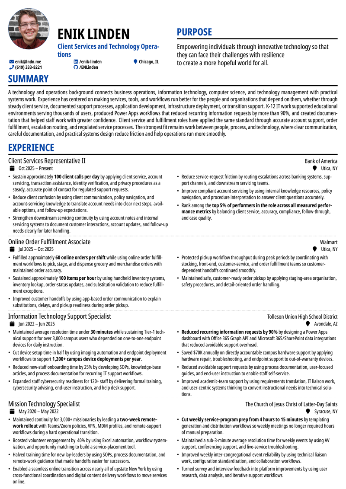

# CV Operating Framework

This repository maintains a verbose master CV and supporting evidence files used to create branched, role-specific CVs and cover letters. The goal is not to keep one universal submission document. The goal is to maintain a source of truth, then branch from it for each application or role family.

## Core Principle

Do not specialize from memory. Specialize from the master materials:

- `cv_master.tex` contains the verbose, annotated master CV.
- `master_claims.md` tracks evidence status for substantive claims.
- `skill_claim_map.md` maps visible experience bullets to the skills they substantiate.
- `cv.tex` is the current rendered CV variant.
- `cv_skills.txt` is the broader skill and experience inventory.

When creating a targeted CV, copy and narrow. Do not delete useful master material from the source branch just because it is not relevant to one application.

## File Roles

- `preamble.tex`: Shared layout, header, links, color, and personal information.
- `cv_master.tex`: Verbose master CV with claim comments. Treat this as the main source for specialization.
- `cv.tex`: Current standard CV render. Branch-specific versions may edit this directly after copying relevant material from `cv_master.tex`.
- `master_claims.md`: Claim audit. Use this before deciding whether a claim is safe for a submission.
- `skill_claim_map.md`: Skill-to-bullet map. Use this to ensure retained skills have visible supporting evidence.
- `cv_skills.txt`: Broad skill and experience inventory, including items that may not be active in the rendered CV.
- `cover_letter.tex`: Standard cover letter source.
- `references.tex`: References source.
- `cv_colorful.tex`: Color render wrapper for the CV.
- `*.pdf`: Generated outputs. Rebuild after source changes.
- `cv_colorful_thumbnail.png`: Generated preview thumbnail for the README.

## Claim Status Rules

Use `master_claims.md` as the authority for claim confidence.

- `VERIFIED`: Supported by records, source material, or other documentary evidence.
- `USER_CONFIRMED`: Confirmed directly by Enik, but not necessarily tied to external records.
- `NEEDS_SOURCE`: Plausible but should be treated carefully in submissions.
- `NEEDS_QUANTIFICATION`: Experience is plausible or known, but the metric needs confirmation.
- `REMOVE`: Do not use as an active claim.

For targeted applications, prefer `VERIFIED` and `USER_CONFIRMED` claims. Use `NEEDS_SOURCE` claims only when the wording is qualitative and defensible. Do not use `REMOVE` claims.

## Skill Coverage Rules

Use `skill_claim_map.md` before finalizing any targeted CV.

If a skill is listed in a targeted skills section, at least one retained experience bullet should support it. Skills can remain in the verbose master even when they are not used in a specific targeted CV.

When narrowing:

1. Identify the role's key skills and keywords.
2. Find matching bullets in `skill_claim_map.md`.
3. Keep the strongest bullets that prove those skills.
4. Remove or de-emphasize skills without retained evidence in that targeted version.
5. Preserve evidence-rich bullets over responsibility-only bullets.

## Branching Workflow

Create a branch for each application or role family.

Recommended branch names:

```bash
git switch -c role/client-services-operations
git switch -c role/it-support-analyst
git switch -c app/company-role-date
```

Use role-family branches for reusable templates, and application branches for a specific employer and posting.

## Specialization Workflow

1. Start from the current source branch.
2. Create a new branch.
3. Read the target job posting carefully.
4. Identify the target role family and top requirements.
5. Select relevant bullets from `cv_master.tex`.
6. Check each selected bullet against `master_claims.md`.
7. Check retained skills against `skill_claim_map.md`.
8. Edit `cv.tex` for the targeted version.
9. Edit the summary last, after the bullet mix is known.
10. Update `cover_letter.tex` from the same claim set.
11. Build PDFs.
12. Inspect the PDF visually before submission.
13. Commit the branch-specific source and generated PDFs.

## Tone and Positioning

The current external positioning is broad technology operations, client service, and systems/process improvement. Do not over-specialize the base materials as pure automation, pure help desk, pure banking, or pure software development unless the branch is explicitly for that target.

Preferred positioning themes:

- Making services, tools, and workflows run better for the people and organizations that depend on them.
- Creating, managing, documenting, and improving systems and processes.
- Supporting users with accuracy, steadiness, and follow-through.
- Reducing friction through clear communication, practical tools, and maintainable documentation.
- Keeping operations running through transitions, support workflows, and service handoffs.

Avoid first-person pronouns in the CV body unless intentionally creating a different voice for a cover letter or profile.

## Build Commands

Build the main CV outputs:

```bash
latexmk -xelatex -nobibtex -f -synctex=1 -interaction=nonstopmode -file-line-error -outdir=. cv.tex cv_master.tex cv_colorful.tex
```

Refresh the README thumbnail:

```bash
pdftoppm -png -f 1 -singlefile cv_colorful.pdf cv_colorful_thumbnail
ffmpeg -y -i cv_colorful_thumbnail.png -vf scale=800:-1 cv_colorful_thumbnail_resized.png
mv cv_colorful_thumbnail_resized.png cv_colorful_thumbnail.png
```

Check generated PDF page counts:

```bash
pdfinfo cv.pdf
pdfinfo cv_master.pdf
pdfinfo cv_colorful.pdf
```

Check source formatting:

```bash
git diff --check
```

## Submission Checklist

Before submitting a targeted CV:

- The branch name identifies the role family or application.
- `cv.tex` is targeted to the posting.
- The summary matches the actual retained experience bullets.
- Every listed skill is supported by at least one retained bullet or a deliberate portfolio/coursework reference.
- Strong metrics are retained where relevant.
- Unsupported or parked claims are excluded unless deliberately softened.
- Links in the header are visible and clickable in the PDF.
- The PDF visually fits without awkward overflow.
- `cv.pdf` and any requested colorful/reference/cover-letter PDFs are rebuilt.
- The final files are committed on the branch.

## Agent Instructions

When an AI agent works in this repository:

- Read `cv_master.tex`, `master_claims.md`, and `skill_claim_map.md` before specializing a CV.
- Preserve the existing two-column structure inside each job entry unless explicitly instructed otherwise.
- Do not remove skills from the master inventory merely because one application does not need them.
- Do not use claims marked `REMOVE`.
- Do not promote `NEEDS_SOURCE` or `NEEDS_QUANTIFICATION` claims into strong quantified language without user confirmation.
- Keep links visible in the PDF header.
- Rebuild PDFs after rendered LaTeX changes.
- Run `git diff --check`.
- Report build warnings honestly, but distinguish known template warnings from blocking failures.

## Example CV

[](cv_colorful.pdf)
